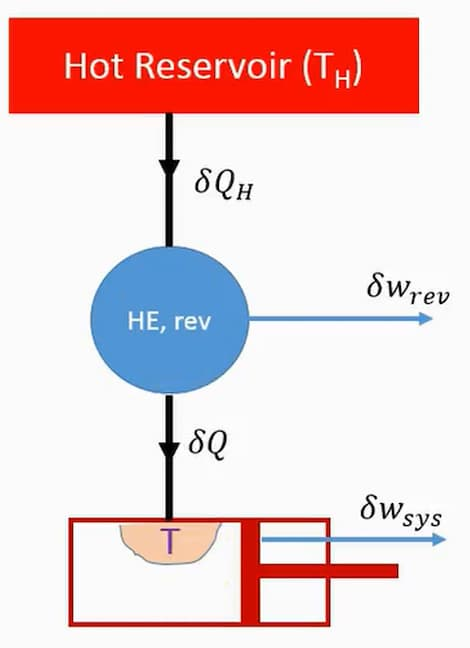

Emerged from 2nd law of thermodynamics. Denoted by $S$. Not a conserved property.

There exists a property of a closed system such that a change in its value is equal to $\int_1^2 \frac{\delta Q}{T}$, for any reversible process undergone by the system between state 1 and state 2.

```math
\Delta S = \int_1^2 \frac{\delta Q}{T}
```

:::note[Proof Hint]

Proof by method of contradiction when the Clausius inequality is taken as valid.

:::

Absolute value of entropy cannot be found from the above equation.

### Clausius Inequality

Aka. Clausius theorem. For a thermodynamic system exchanging heat with external thermal reservoirs, and undergoing a thermodynamic cycle, the following inequality holds:

```math
\oint \frac{\delta Q}{T} \leq 0
```

If the the cycle is reversible, the inequality becomes an equality:

```math
\oint \frac{\delta Q}{T} = \begin{cases}
\lt 0 & \text{cycle is reversible} \\
= 0 & \text{cycle is reversible} \\
\gt 0 & \text{cycle is impossible}
\end{cases}
```

:::note[Proof Hint]



- For the reversible heat engine: $\frac{\delta Q_H}{T_H} = \frac{\delta Q}{T}$
- $delta W_\text{total} = \delta W_\text{rev} + \delta W_\text{sys}$
- As Kelvin-Planck statement, it is impossible for $\delta W_\text{total} \gt 0$ as there is only one thermal reservoir.

::

## Principle of Increase of Entropy

For an isolated system, the entropy of the system never decreases. If the process undergone by the system is reversible, entropy remains constant. If the process is irreversible, entropy increases.

```math
\Delta S_\text{isolated} \geq 0
```
