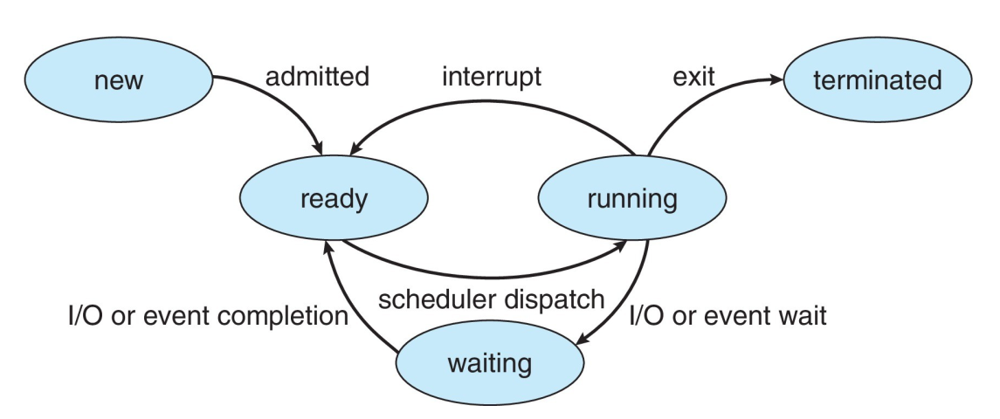

A program that acts as an intermediary between a user of a
computer and the computer hardware. Works as a resource allocator.

### System programs

Ships with an OS, but not part of the kernal.

### System call

Aka. syscall. An interface that allows user-level programs to request services from the operating system kernel. Runs in kernal mode. Provides a controlled entry point into the kernel. Essential for maintaining security and stability of the system by mediating access to hardware resources.

Common categories of system calls include:

- Process control (create, terminate, wait, allocate memory)
- File management (create, open, close, read, write files)
- Device management (request/release devices, read/write to devices)
- Information maintenance (get/set time, system data)
- Communication (create/delete connections, send/receive messages)
- Protection (set/get permissions)

When a user program performs a system call, it places the system call arguments in predefined registers (or sometimes the user stack), then executes a special instruction (like syscall or int 0x80) to switch to kernel mode. The kernel then copies the arguments to the kernel stack as needed.

## Goals

- Execute user programs and make solving user problems easier
- Make the computer system convenient to use
- Use the computer hardware in an efficient manner

## Program

A passive entity stored on disk. Aka. executable file.

## Process

A program in execution. An active entity. Program becomes active when it is loaded into memory. Instructions of a process are executed in sequence. Has multiple parts:

- text section: the program code
- program counter
- stack: containing temporary information i.e. function parameters, return addresses, local variables
- heap: containing dynamically allocated memory
- data section: containing global variables
  
### Context

The information about a process that is used to track and manage its execution. This includes the process's Program Counter (PC), stack pointer, register contents, and other critical data. The OS saves the context when switching between processes (context switch) and restores it when the process resumes execution. Context switching is a computationally expensive operation that affects system performance.

### State



- New: The process is being created
- Running: Instructions are being executed
- Waiting: The process is waiting for some event to occur
- Ready: The process is waiting to be assigned to a processor
- Terminated: The process has finished execution

### Process Control Block

Aka. PCB, task control block. Information about a process. Contains:

- State
- Program counter
- CPU registers - contents of all process-centric registers
- Scheduler information such as priority, queue pointers
- Memory Address Space
- Accounting information such as CPU time used, memory usage, I/O operations
- I/O Devices
- Signal Handlers
- Process ID
- Parent Process ID
- File Descriptors

#### Representation in Linux

```c
struct task_struct {
    pid t_pid; /* process identifier */
    long state; /* state of the process */
    unsigned int time_slice; /* scheduling information */
    struct task_struct *parent;/* this process’s parent */
    struct list_head children; /* this process’s children */
    struct files_struct *files;/* list of open files */
    struct mm_struct *mm; /* address space of this process */
}
```
